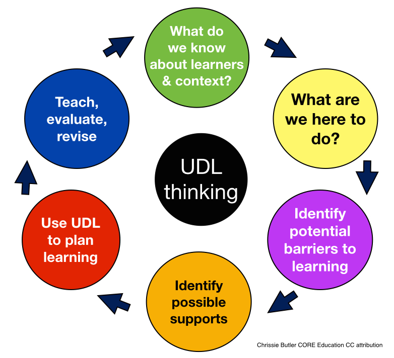

### Learning should be ACCESSIBLE
We talked a bit about multi-access in the previous topic, but I want to focus on the barriers that might prevent students from learning.
- unpredictable internet access
- confusing technology (pwpt, Moodle, etc.)
- lack of motivation
- lack of support
- course is difficult to navigate
- language/cultural barriers

What other concerns have you heard from students, or that you have felt yourself as you encounter a new learning tool?

As we design our courses, we want to incorporate inclusive learning, or principles of **Universal Design for Learning** (UDL). The Higher Education Opportunity Act of 2008 defines this approach to curriculum and teaching:

! “The term ‘universal design for learning’ means a scientifically valid framework for guiding educational practice that–
! provides flexibility in the ways information is presented, in the ways students respond or demonstrate knowledge and skills, and in the ways students are engaged; and
! reduces barriers in instruction, provides appropriate accommodations, supports, and challenges, and maintains high achievement expectations for all students, including students with disabilities and students who are limited English proficient” (110th Congress, 2008).

In the learning activity below, there are several resources on Universal Design for Learning.  Before you scan those, take a look at the following graphic organizer and consider the steps you can take to design your courses for all learners.

### Learning Activities
[plugin:content-inject](../../_1-6)
