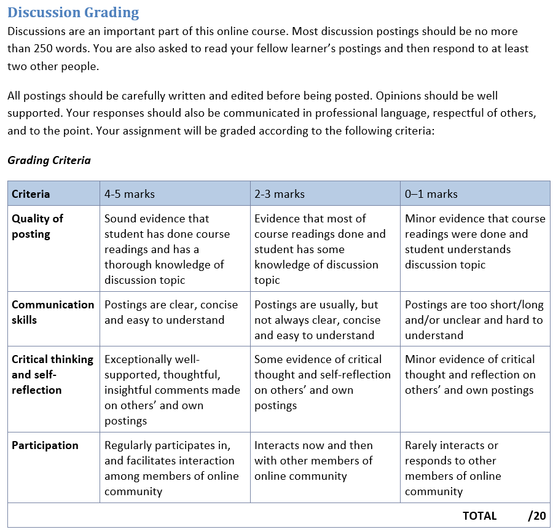
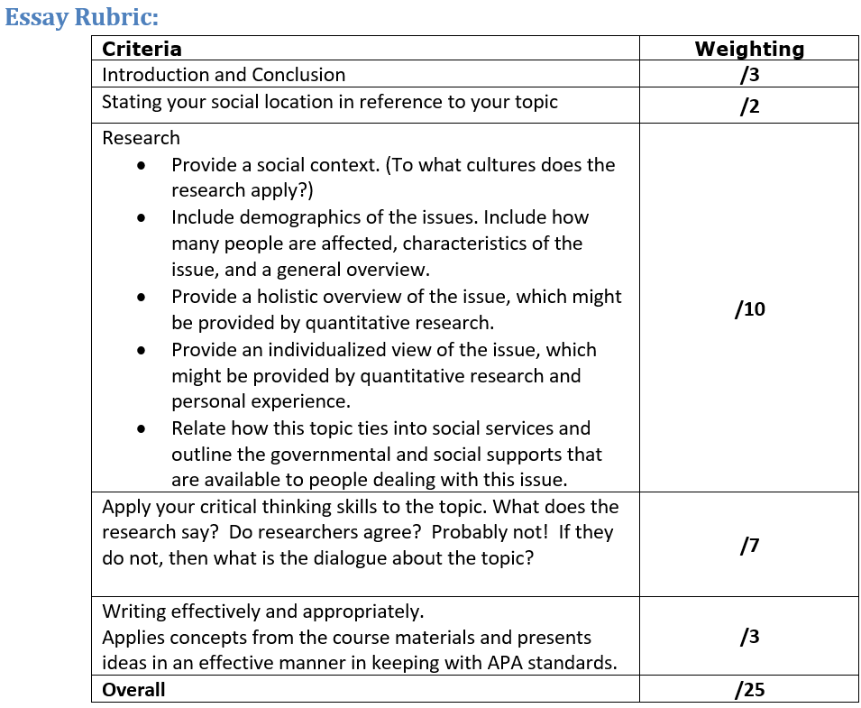
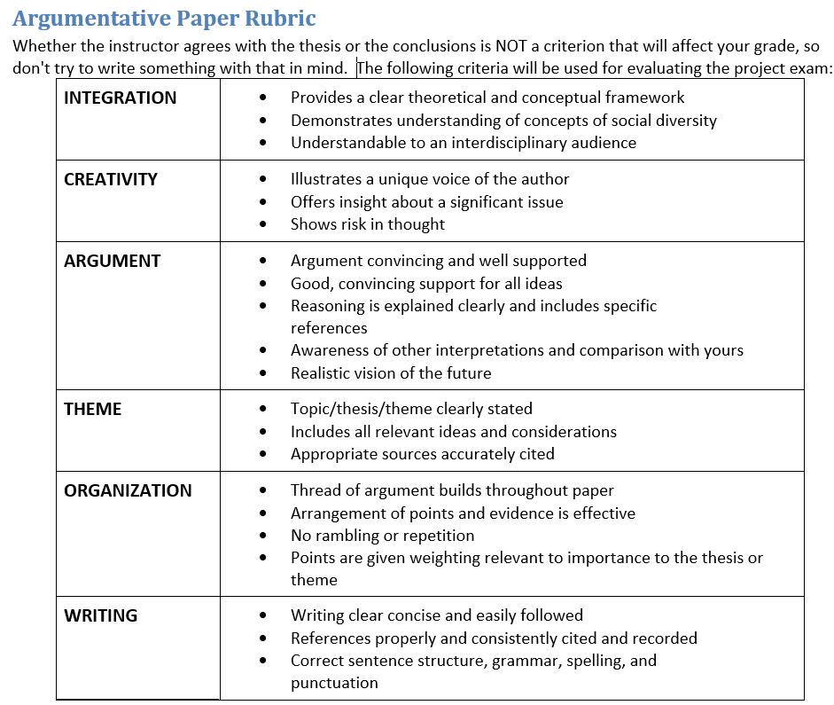
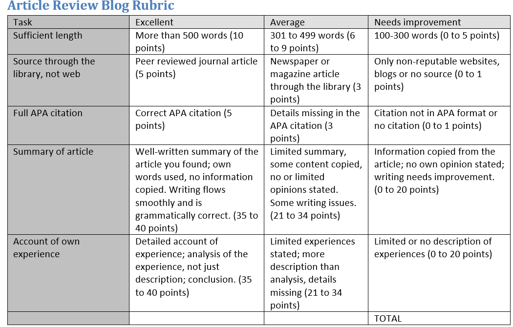
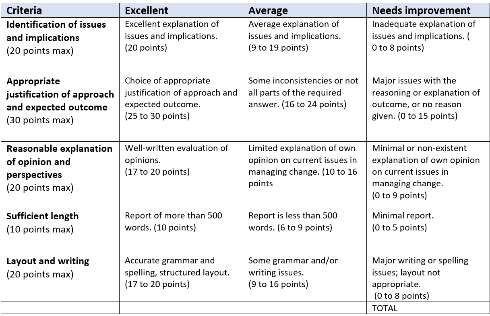

## Topic 3: Grading Rubrics & Peer Assessment

### Grading with Rubrics
When giving students an assignment, it is crucial to explain to them exactly what you’re looking for and how you will assess their work. A rubric is one tool that can be used to authentically assess learners. It contains the list of criteria that highlights the what the learner is expected to do or demonstrate. Along with the criteria, a rubric provides examples of what is expected at each level of performance, from poor to excellent. Providing this criteria up front to learners allows them to assess their progress and compare to a performance level.

Below are some examples of rubric use in our online courses.

You'll notice the last two in particular have a detailed range of "Needs Improvement" to "Exceeds Expectations".  If possible, try to work out the details of what you're looking for at each level of mastery. This helps not only when you're grading students' work, but also when you need to explain the grade you gave.

### Peer Feedback
One last important topic to cover in our assessment unit is about the value of peer feedback.
Peer assessment can:
- improve student work/performance
- offer timely feedback
- reduce grading workload
- help make your grading criteria more clear (as students use it to evaluate their peers)
- allow for critical reflection (of students' own work & their peers)

To this last point, consider as well asking students to self-evaluate their work, acknowledging feedback from peers and/or the instructor and setting goals for improvement.

### Learning Activities
[plugin:content-inject](../_4-12)
