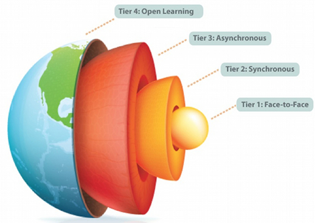

## What is Multi-Access Learning?

*Online learning, blended, flipped, face-to-face, hybrid, multi-access...* you may have heard some of these terms tossed around, especially recently with the shifting focus to online.  Before we unpack and examine these modalities of learning, consider how learning in Higher Education has changed.  Not just recently with the impact of COVID-19, but the shifts that have happened in the last 20, 10, 5 years.  How has technology shaped the way you teach and the way your students learn?

### Learning Activities
[plugin:content-inject](../_1-1)

One trend that is gaining traction is **Multi-Access Learning**. Read the following excerpt from *Realigning Higher Education for the 21st-Century Learner through Multi-Access Learning* by Irvine, Code & Richards (2013).

! Multi-access learning is an opportunity to meet both student needs for access to learning experiences and faculty needs for graduate student recruitment (Irvine, 2009; Irvine & Code, 2011, 2012; Irvine & Richards, 2013). Irvine defines multi-access learning as a framework for enabling students in both face-to-face and online contexts to personalize learning experiences while engaging as a part of the same course. Multi-access learning is different than blended learning because it places the student at the center of the learning experience as opposed to the instructor or the institution.

!Further, "blended learning" is a problematic term due to its multiple interpretations in the literature and in daily practice, leaving one to ask, "Who controls the blend?" When and where the face-to-face sessions occur and when and how the online synchronous or asynchronous sessions occur are often controlled in blended learning settings. At the core, the institution or instructor is in control of the blend, no matter the configuration.

! Multi-access learning, however, has the learner at the center, with the ability to choose how he/she wants to access the course. The core principle of the multi-access framework is one of enabling student choice in terms of the combination of course delivery methods through which the learning environment is accessed; that is, each individual learner decides how he/she wishes to take the course (e.g., face-to-face or online) and can then participate with other students and the instructor – each of whom have their own modality preferences – at the same time" (Irvine, Code & Richards, 2013).

With the uncertainty brought on by COVID-19, multi-access learning has great potential for our education system.  This modality not only brings more choice to students, but promotes a learner-centred course design and best practices in teaching and learning.

### Learning Activities
[plugin:content-inject](../_1-2)

So how does this Multi-Access model of learning compare to what you have experienced as an instructor?  You may teach online, on campus, or have a blended approach in your courses.  What are the key differences between these approaches and modalities?

### Learning Activities
[plugin:content-inject](../_1-3)

### Learning Activities
[plugin:content-inject](../_1-4)

!!! Before moving on to the next topic, consider what design principles and techniques were used in this first course topic.  Are there any you might consider using in developing your online course?
